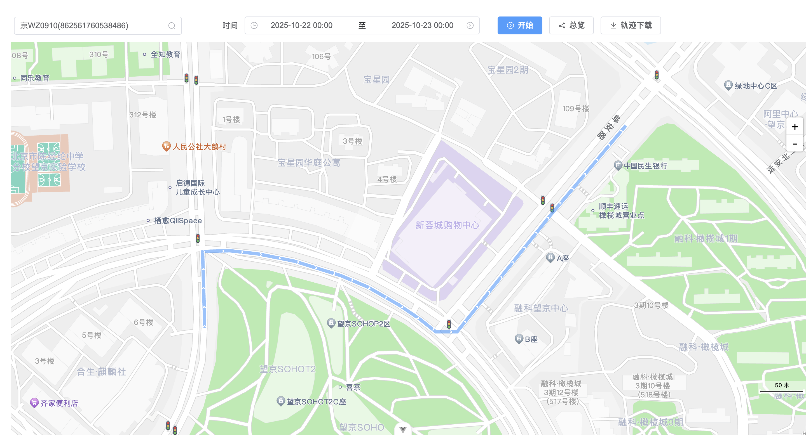

# gaode_trajectory_utils

## 简介

结合高德地图，实现地图自定义撒点、实时交通展示、点聚合、SSE实时数据更新、轨迹回放。同时封装了SSE连接工具，包含重试间隔、最大重试次数、自动重试

## 项目预览




## 说明

### 1、环境变量

**使用前需要将环境变量文件中的VITE_AMAP_JS_SECURITY_KEY和VITE_AMAP_JS_KEY更换成自己申请的key**

### 2、工具类

所有关于高德地图API的整合都在src/utils/mapLoader.ts文件中

### 3、自定义弹窗展示

因为涉及到数据更新和传递，使用vue的h函数，渲染了InfoWindow组件，从而达到数据传递的需求

### 4、点标记实时更新

结合SSE，当数据变化时，会接到最新的数据，

### 5、SSE使用示例

在本demo中，sse可以用来做通知/点位变化。

本质上就是 接到数据变化的通知后，重新渲染点位，并清除之前打开的弹窗。重新渲染点位addMarkers方法在mapLoader文件中。

```vue
import { useSSE } from '@/utils/useSSE' const sse = useSSE("/mock/api/sse/trace") watch( () =>
sse.data.value, (res: any) => { // 监听到sse变化后，更新点位，并关闭之前的打开的弹窗 const
markersArr: any[] = [] res.forEach((item: any) => { markersArr.push({ id: item.id, position:
[Number(item.lng), Number(item.lat)], type: item.inFence ? "charging" : item.status === "静止" ?
"stop" : "online", clickCallBack: clickMarker, showCarId: showCarLicense.value }) }) nextTick(() =>
{ props.mapLoader.closeInfoWindow() }) props.mapLoader.addMarkers(markersArr) }, { deep: true } )
```

## 写在最后

之前在掘金写过一篇记录的帖子，贴了代码。但是在后来的测试过程中，发现：sse数据发送变化，如果此时勾选了展示车牌的按钮，会导致sse数据每变化一次，展示车牌的div就会渲染一次，而不是渲染新的。在这个demo中修复了该问题，主要是原因是createOrUpdateCluster方法渲染车牌时使用的是Text，后来改成了Label。

掘金：https://juejin.cn/post/7542441287912685619

## MIT License © 2022-PRESENT [FJK](https://github.com/fjk996082110)
